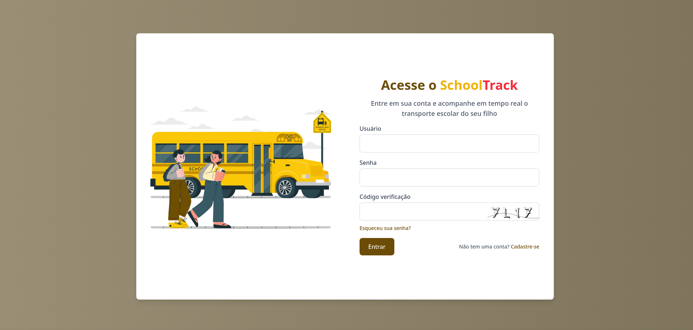
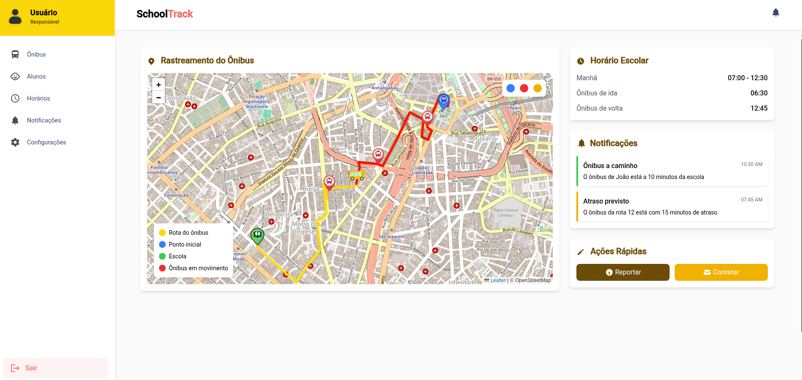
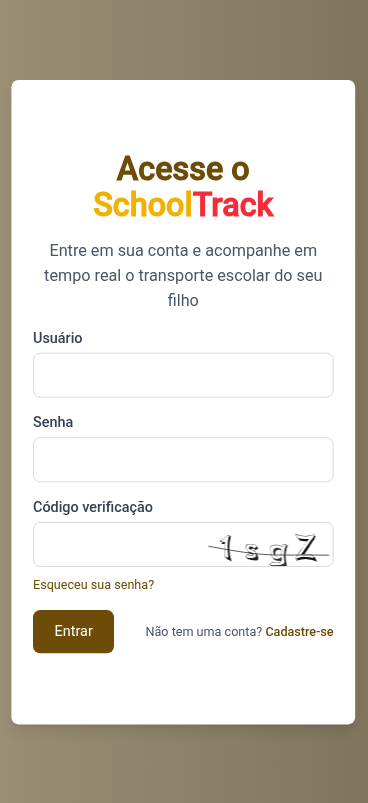
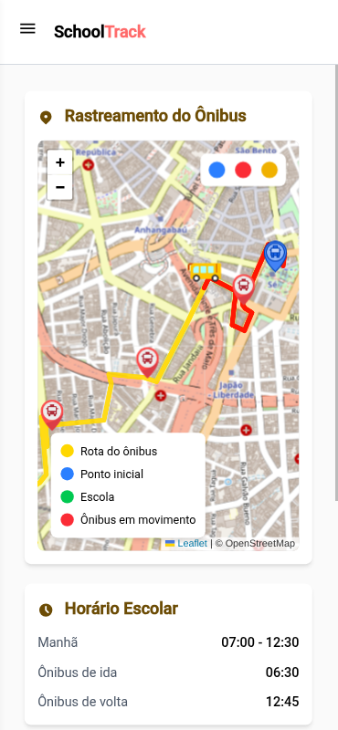
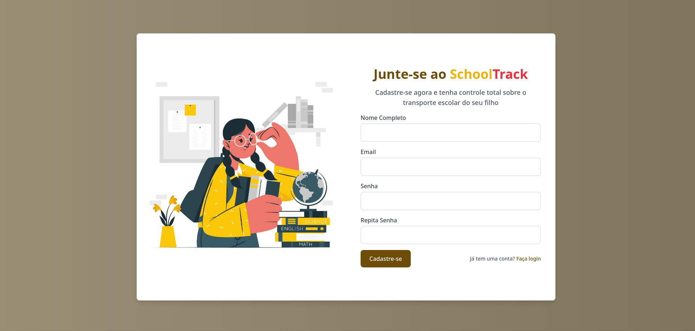

# SchoolTrack - Sistema de Rastreamento de Ônibus Escolar

 

O SchoolTrack é uma solução inovadora para monitoramento em tempo real de frotas de transporte escolar, proporcionando segurança e tranquilidade para pais, alunos e gestores.

## ✨ Recursos Principais

- 🚍 Rastreamento em tempo real dos veículos
- 🔔 Notificações de chegada e saída
- 📊 Relatórios de rotas e horários
- 👨‍👩‍👧‍👦 Acesso multiplataforma para pais e escolas

## 🖼️ Screenshots

  
  

## 🛠️ Tecnologias Utilizadas

- Angular 19
- Tailwind CSS
- TypeScript
- OpenStreetMap (Gratuita)
- Node.js (Backend)

## 📦 Estrutura de Arquivos

src/
├── app/
│ ├── core/
│ │ ├── auth/
│ │ ├── guards/
│ │ ├── interceptors/
│ │ └── services/
│ ├── features/
│ │ ├── auth/
│ │ ├── admin/
│ │ ├── parent/
│ │ ├── driver/
│ │ └── shared/
│ ├── shared/
│ │ ├── components/
│ │ ├── directives/
│ │ ├── pipes/
│ │ └── utils/
│ └── app.config.ts
├── assets/
│ ├── images/
│ └── styles/
└── environments/
